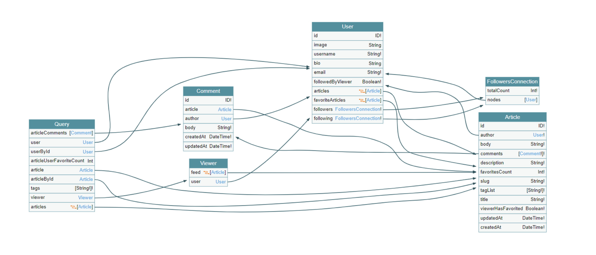
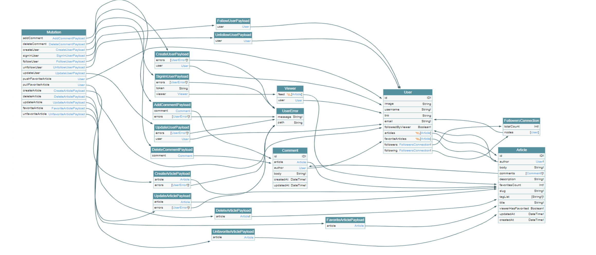

# GraphQL Microservices RealWorld Example System

[](https://app.circleci.com/pipelines/github/danstarns/graphql-microservices-realworld-example-system?branch=master)
[](https://github.com/danstarns/graphql-microservices-realworld-example-system/blob/master/LICENSE)

> ### Node.js powered distributed GraphQL schema built with modules, authentication, pagination, and more.

# About

This codebase was created to demonstrate a distributed GraphQL schema built with [**idio-graphql**](https://danstarns.github.io/idio-graphql/) including modules, authentication, pagination, and more. 

> There is a React frontend that works with this system [here](https://github.com/dostu/react-apollo-realworld-example-app)

# Contributing

1. [Eslint](https://eslint.org/) => `./eslintrc`
2. [Git Trunk](https://trunkbaseddevelopment.com/) => `PR|>master`
3. [Tests](#testing)

# Getting started

> Docker is the best way to start

1. Setup [Environment Variables](#Environment-Variables)
2. `docker-compose up`
3. Start client [here](https://github.com/dostu/react-apollo-realworld-example-app)
# Environment Variables

> To start, copy `./.env.example`, in each service, to `./.env`.

## Gateway Service 

```
NATS_URL=nats://host.docker.internal:4222
PORT=3000
MONGODB_URI=mongodb://host.docker.internal:27017/gateway
DEBUG=@Conduit-Gateway-Service:*
SECRET=supersecret
NODE_ENV=develop
```

## Article Service

```
NATS_URL=nats://host.docker.internal:4222
MONGODB_URI=mongodb://host.docker.internal:27017/Conduit
DEBUG=@Conduit-Article-Service:*
NODE_ENV=develop
```

## Comment Service

```
NATS_URL=nats://host.docker.internal:4222
MONGODB_URI=mongodb://host.docker.internal:27017/Conduit
DEBUG=@Conduit-Comment-Service:*
NODE_ENV=develop
```

# GraphQL Schema

The foundations of this schema were ported from [rails-graphql-realworld-example-app](https://github.com/dostu/rails-graphql-realworld-example-app), although changes have been made, both for simplicity & to lean on features provided by `idio-graphql` such as [Inter-Schema Execution](https://danstarns.github.io/idio-graphql/docs/inter-schema-execution).

> Graphs generated from [Graphql Voyager](https://github.com/APIs-guru/graphql-voyager) available @ http://localhost:3000/voyager

### Query


### Mutation


### SDL
```graphql
directive @Auth(input: AuthInput) on FIELD_DEFINITION

input AddCommentInput {
  articleId: ID!
  body: String!
}

type AddCommentPayload {
  comment: Comment
  errors: [UserError!]!
}

type Article {
  id: ID!
  author: User!
  body: String!
  comments: [Comment!]!
  description: String!
  favoritesCount: Int!
  slug: String!
  tagList: [String!]!
  title: String!
  viewerHasFavorited: Boolean!
  updatedAt: DateTime!
  createdAt: DateTime!
}

type ArticleConnection {
  edges: [ArticleEdge]
  pageInfo: PageInfo!
}

type ArticleEdge {
  cursor: String!
  node: Article
}

input AuthInput {
  required: Boolean!
  populate: Boolean = false
}

type Comment {
  id: ID!
  article: Article
  author: User
  body: String!
  createdAt: DateTime!
  updatedAt: DateTime!
}

input CreateArticleInput {
  title: String!
  description: String!
  body: String!
  tagList: [String!]!
}

type CreateArticlePayload {
  article: Article
  errors: [UserError!]!
}

input CreateUserInput {
  username: String!
  email: String!
  password: String!
}

type CreateUserPayload {
  errors: [UserError!]!
  user: User
}

scalar DateTime

input DeleteArticleInput {
  id: ID!
}

type DeleteArticlePayload {
  article: Article!
}

input DeleteCommentInput {
  id: ID!
}

type DeleteCommentPayload {
  comment: Comment
}

input FavoriteArticleInput {
  id: ID!
}

type FavoriteArticlePayload {
  article: Article
}

type FollowersConnection {
  totalCount: Int!
  nodes: [User]
}

input FollowUserInput {
  id: ID!
}

type FollowUserPayload {
  user: User
}

type Mutation {
  addComment(input: AddCommentInput!): AddCommentPayload
  deleteComment(input: DeleteCommentInput!): DeleteCommentPayload
  createUser(input: CreateUserInput!): CreateUserPayload
  signInUser(input: SignInUserInput!): SignInUserPayload
  followUser(input: FollowUserInput!): FollowUserPayload
  unfollowUser(input: UnfollowUserInput!): UnfollowUserPayload
  updateUser(input: UpdateUserInput!): UpdateUserPayload
  pushFavoriteArticle(article: ID!): User
  pullFavoriteArticle(article: ID!): User
  createArticle(input: CreateArticleInput!): CreateArticlePayload
  deleteArticle(input: DeleteArticleInput!): DeleteArticlePayload
  updateArticle(input: UpdateArticleInput!): UpdateArticlePayload
  favoriteArticle(input: FavoriteArticleInput!): FavoriteArticlePayload
  unfavoriteArticle(input: UnfavoriteArticleInput!): UnfavoriteArticlePayload
}

type PageInfo {
  endCursor: String
  hasNextPage: Boolean
}

type Query {
  articleComments(article: ID!): [Comment]
  user(username: String!): User
  userById(id: ID!): User
  articleUserFavoriteCount(article: ID!): Int
  article(slug: String!): Article
  articleById(id: ID!): Article
  tags: [String!]!
  viewer: Viewer
  articles(first: Int = 10, after: String = "1", tag: String, forUser: Boolean, feed: Boolean, ids: [String]): ArticleConnection!
}

input SignInUserInput {
  email: String!
  password: String!
}

type SignInUserPayload {
  errors: [UserError!]!
  token: String
  viewer: Viewer
}

input UnfavoriteArticleInput {
  id: ID!
}

type UnfavoriteArticlePayload {
  article: Article
}

input UnfollowUserInput {
  id: ID!
}

type UnfollowUserPayload {
  user: User
}

input UpdateArticleInput {
  id: ID!
  title: String!
  description: String!
  body: String!
  tagList: [String!]!
}

type UpdateArticlePayload {
  article: Article
  errors: [UserError!]!
}

input UpdateUserInput {
  email: String!
  username: String!
  bio: String
  image: String
  password: String
}

type UpdateUserPayload {
  errors: [UserError!]!
  user: User
}

type User {
  id: ID!
  image: String
  username: String!
  bio: String
  email: String!
  followedByViewer: Boolean!
  articles(first: Int = 10, after: String = "1"): ArticleConnection!
  favoriteArticles(first: Int = 10, after: String = "1"): ArticleConnection!
  followers: FollowersConnection!
  following: FollowersConnection!
}

type UserEdge {
  cursor: String!
  node: User
}

type UserError {
  message: String!
  path: String
}

type Viewer {
  feed(first: Int, after: String): ArticleConnection!
  user: User
}
```

# Testing

> Its recommended to run all test's in Docker

1. [`mocha`](https://www.npmjs.com/package/mocha)
2. [`chai`](https://www.npmjs.com/package/chai)
3. [`nyc`](https://www.npmjs.com/package/nyc)
5. [`apollo-server-testing`](https://www.npmjs.com/package/apollo-server-testing)

You can run this projects test suite with `$ npm run test-docker`.